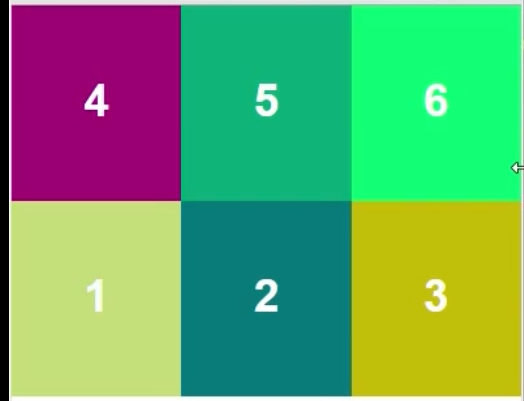
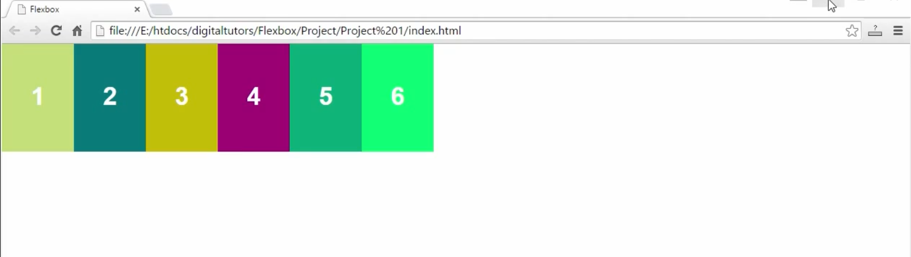
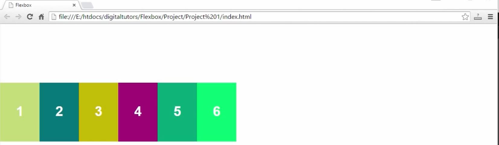
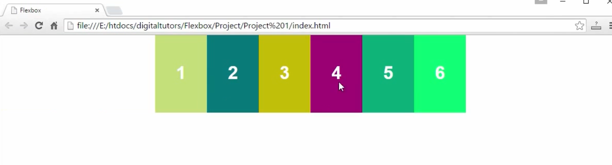
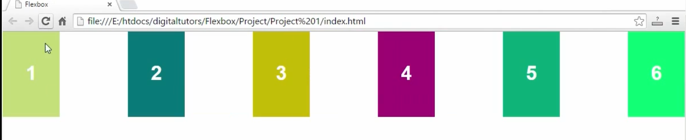
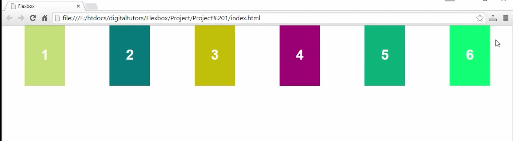
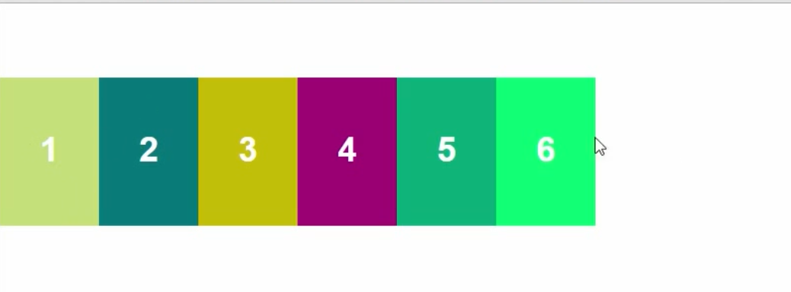
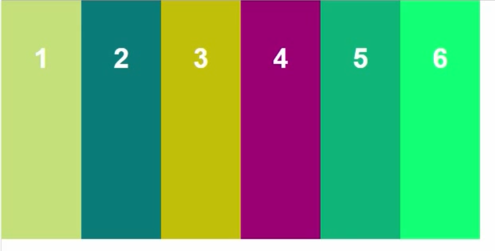
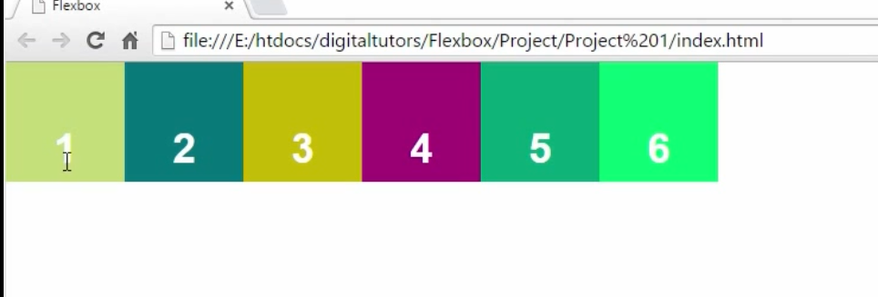

## display: flex

## flex-grow: 1

## order 
This allows you to specify the order in which the items are displayed in the flexbox container. By default, the order is disctaed by the order order you have the elements are setup in the html code.
`order: 2`

## flex-direction
Allows you to specify 4 different values that control how the items are laid out - horizontally or vertically (in other words rows vs columns). Row is the default value if not specified.
`flex-direction: row`
`flex-direction: row-reverse`
`flex-direction: column`
`flex-direction: column-reverse`

## flex-wrap: no-wrap - default

## flex-wrap: no-warp-reverse

## flex-wrap: wrap-reverse

## justify-content: flex-start - default

## justify-content: flex-end

## justify-content: flex-center

## justify-content: space-between

## justify-content: space-around

## align-items: flex-start (the container height property should be set)

## align-items: flex-end (the container height property should be set)

## align-items: center (the container height property should be set)

## align-items: stretch

## align-items: baseline

## align-self: flex-start / flex-end / center / stretch / baseline